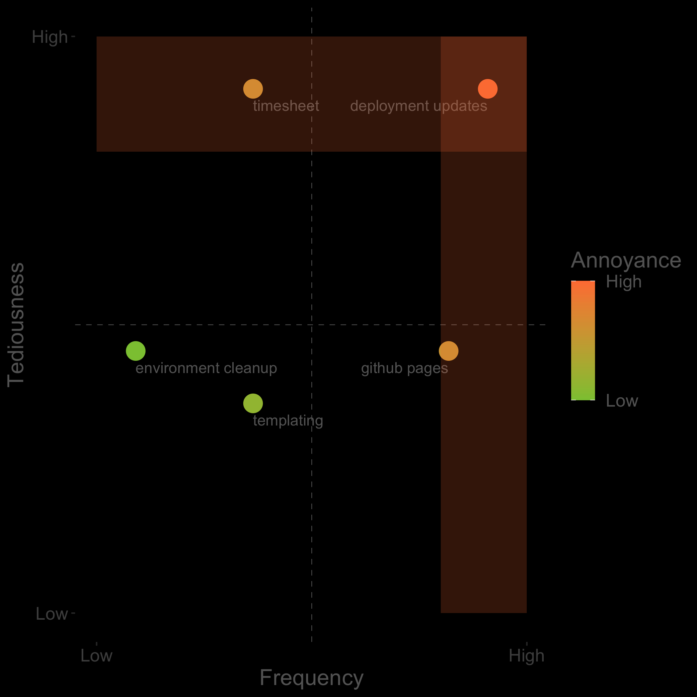

# Conclusion

<!-- .element: style="max-width:50%;max-height:50%" -->
Note:
* First: read a lot so you know what's new. No need to be spending hours to become an expert. Just enough to know what it is, what kind of problem it solves.

## Technical details
<i class="fab fa-chrome"></i> www.pieterjd.be
Note:
* That's it for me - put references on my website
* if you have feedback, if I inspired you to automate a boring task, to save time and to learn something new - just ping me!
