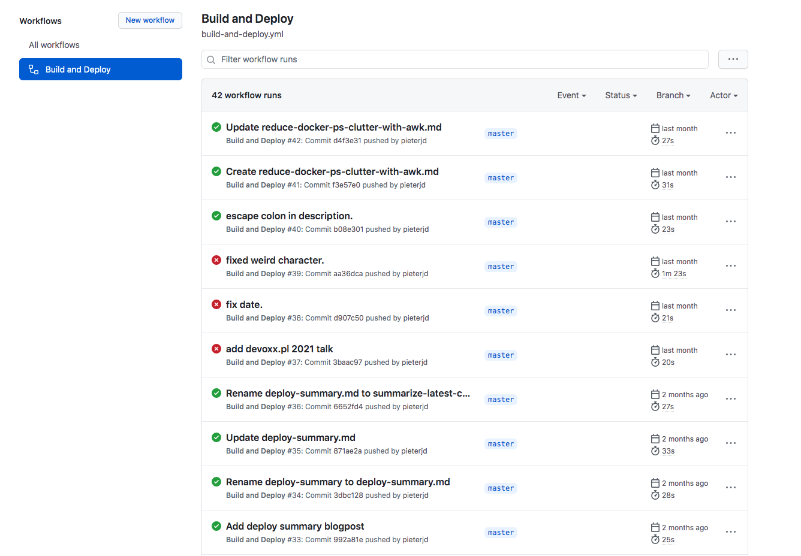
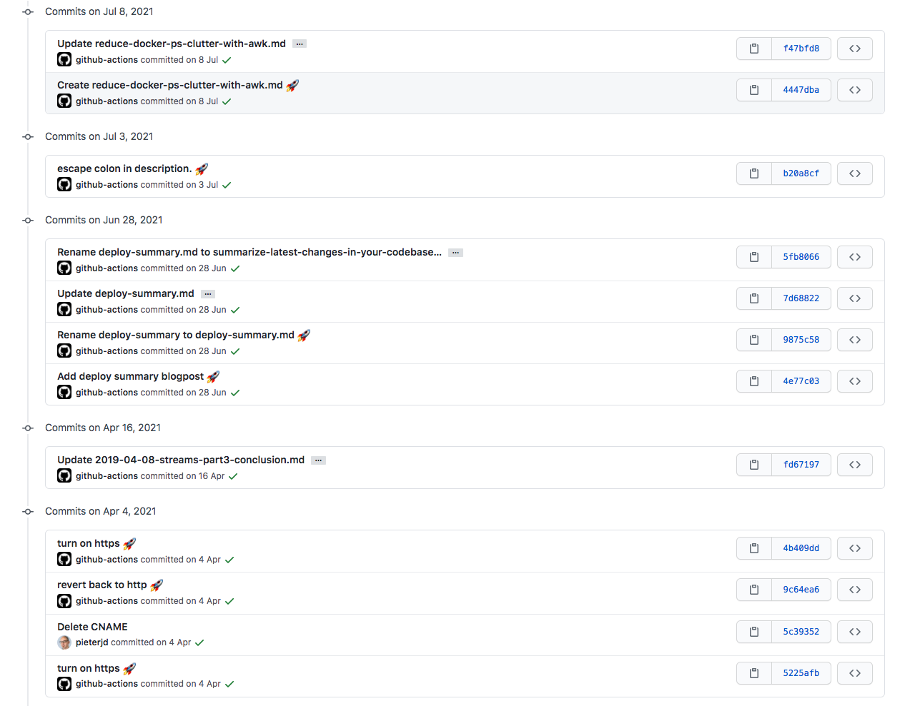

# Website deploy


## Github Pages
* special repo: ``<username>.github.io``
* HTML & CSS


## HUGO
* Static site generator
* Content written in markdown
* Generates all HTML & CSS


### Deploy script
1. Commit & push changes to hugo repository
1. Run hugo
1. Commit & push changes to ``<username>.github.io``
Note:
* Always forget to push all commit changes
* Github Actions - github's pipelines
* Some investigation required but actions available for building hugo websites and pushing to github pages


### Github Actions
```yaml[|2-4|10-14|15-16|17-28]
name: Build and Deploy
on:
  push:
    branches: [master]

jobs:
  build:
    runs-on: ubuntu-latest
    steps:
      - uses: actions/checkout@v2
      - name: setup hugo
        uses: peaceiris/actions-hugo@v2
        with:
          hugo-version: '0.75.1'
      - name: build hugo website
        run: hugo --minify
      - name: deploy to github Pages
        uses: peaceiris/actions-gh-pages@v3
        with:
          publish_dir: ./pieterjd.github.io
          external_repository: pieterjd/pieterjd.github.io
          publish_branch: master
          personal_token: ${{ secrets.GH_PAGES_ACCESS_TOKEN }}
          user_name: 'github-actions[bot]'
          user_email:
              'github-actions[bot]@users.noreply.github.com'
          full_commit_message:
             "${{ github.event.head_commit.message }} :rocket:"
```
Note:
* CLICK - when is pipeline triggered
* CLICK - setup: checkout the hugo repo and install hugo
* CLICK - generate the website
* CLICK - push to github pages repository


### Runs



### Website commits



## What I've learned & saved
* Bash scripting
* Github Actions

* Lot's of time & frustration <!-- .element: class="fragment" data-fragment-index="1"  -->
