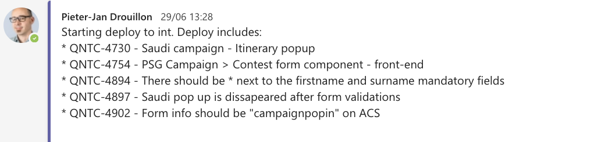

# GIT
Note:
* Fast pace - don't know what has been already deployed
* Multiple deploys every days --> inform team what features/bugfixes/... have been deployed
* tedious: check which version is on the target deployment
* check what new changes will be deployed
* look up the according stories
* collect info and drop in teams/slack/...


## Posting updates
1. fetch version endpoint
```json
{
 "buildNumber":"1.24-SNAPSHOT-r4941",
 "gitHash":"af127f5"
}
```
1. git history
```bash
git log "<githash>..HEAD" --format=format:"%s"
```
1. filter for story ids
1. fetch story description from JIRA
1. ``pbcopy``
Note:
* Including hash of HEAD using maven git plugin (part of spring boot) in version endpoint
* collect new changes on your local system
* commit message contains story id


### Example message



## Clean up Environment
<!-- .element height="70%" width="70%" -->


### list branches
```Powershell
function delete_branches_with_prefix($prefix){
$branches = git branch --list "$prefix*"|%{$_.trim()}
git checkout develop
$branches |%{
 write-host "cleaning $_"
 git branch -d $_
}

function isGitRepo($dir){
 $gitPath = Join-Path -Path $dir -ChildPath ".git"
 return Test-Path -Path $gitPath
}
```


### Delete branches
```powershell
if(isGitRepo((Get-Location).path)){
 delete_branches_with_prefix('bugfix')
 delete_branches_with_prefix('buildfix')
 delete_branches_with_prefix('maintenance')
 delete_branches_with_prefix('feature')
 delete_branches_with_prefix('improvement')
}
else{
 write-host -ForegroundColor Red "No git repo detected"
}
```


## What I've learned & saved
* Brushed up on Git command & Powershell
* Jira QL
* ``pbcopy``

* Lot's of time & frustration
