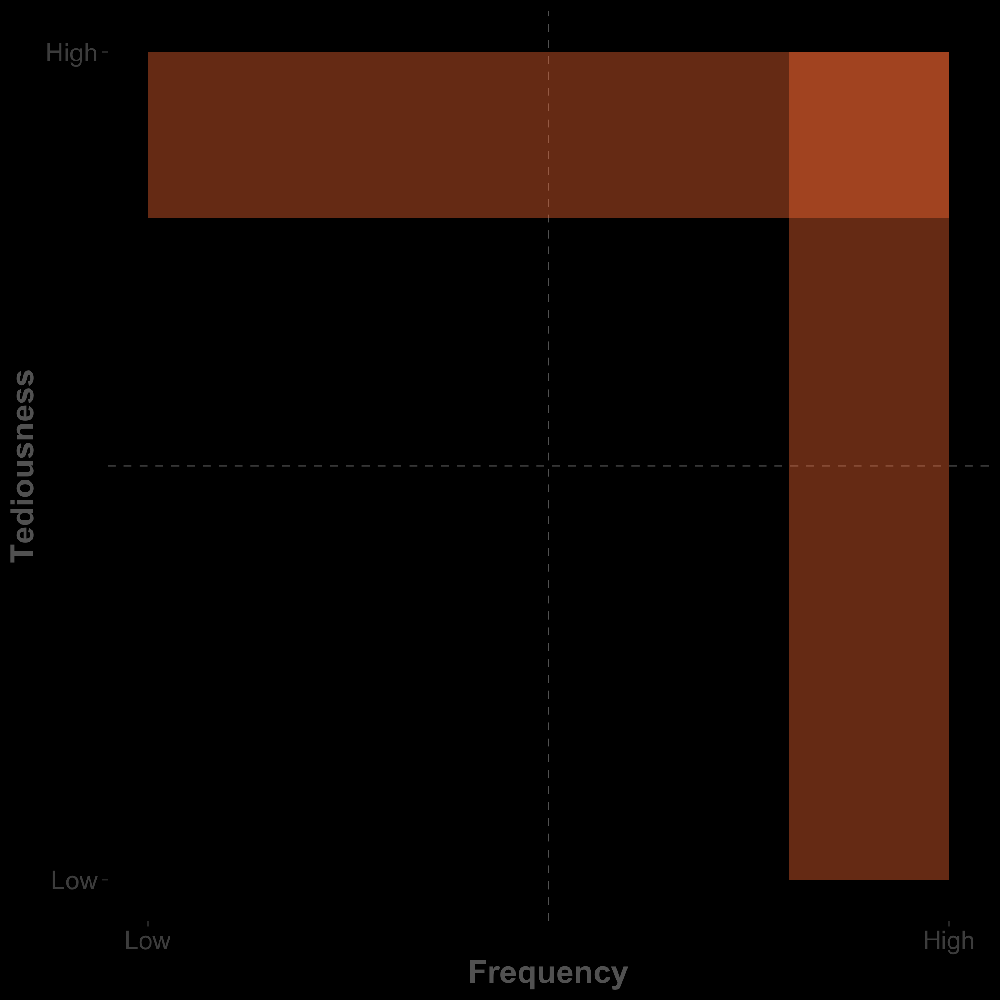

<!-- .slide: data-background-image="../assets/devoxx.pl-titleslide.png" data-background-size="contain" class="title-top-align"-->

Note:
* Welcome to Automate Boring tasks, Save time and learn something new.
* By show of hands: who still has to fill out timesheet for today?
* <b>My name is ....</b>
  * academic backgrounds
  * shortlifed career in Supply Chain
  * Full-stack java/AEM developer at emakina.com
* Ideal talk so late on the day - all technical details on my website, with references to docs
* I'm talking about my journey on how I try to make my professional life easier
* Not an usual developer talk, but I haven't read posts or seen talks before tackling this issue

### What is this talk about?
<!-- .element: style="max-width:50%;max-height:50%" -->
Note:
* boring tasks have 2 criteria: frequency and tediousness
* extremes: on-offs (lower left)  - very frequent and annoying tasks (top right)
* ...
* Before I go over some examples, first a commercial break :)

<!-- .slide: data-background-image="../assets/emakina.png" data-background-size="contain" class="title-top-align"-->
## About Emakina<!-- .element: style="top: 0 !important;"  -->

<!-- .slide: data-background-image="../assets/emakina-clients.png" data-background-size="contain" class="title-top-align"-->
## About Emakina's Clients<!-- .element: style="top: 0 !important;"  -->
