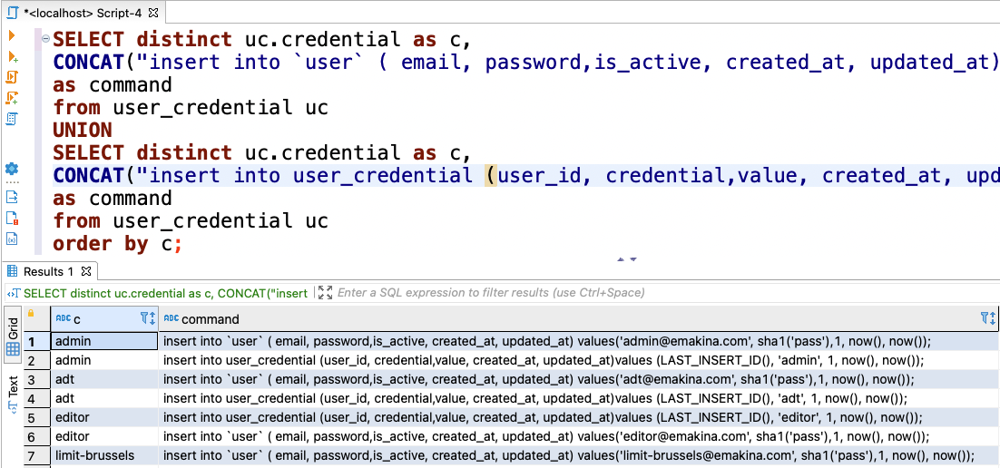

# Templating


## Environment variables
```bash [1|3-4]
http 'Authentication: Bearer 123456789...XYZ' http: //www.example.com

export TOKEN=123456789...XYZ
http "Authentication: Bearer $TOKEN" http://www.example.com
```
Note:
* Investigating API, investigating, writing down calls in my notebook
* Token expires everyday, have to update my notes constantly
* CLICK - Solution: use env variables for token, use this variable in api calls, when new token - just update environment variable


## Scripting - Powershell
```ps[|1-9|4,8|11-12]
$sql_template = @"
insert into `user`
(email, password, is_active, created_at, updated_at)
values('{0}@emakina.com', sha1('pass'), 1, now(), now() );

insert into user_credential
(user_id,credential,value,created_at,updated_at)
values (LAST_INSERT_ID(),'{0}',1,now(),now());
"@

@('admin','press','super-admin','mice','spot')
  |%{$sql_template -f $_}
```
Note:
* Other example: creating users for each security role
* quite some roles
* CLICK - string template
* CLICK - placeholder
* CLICK - loop over values being used as value for the placeholder
* you would think this would be ok for each environment


## Powershell Output
```sql
insert into `user`
(email, password, is_active, created_at, updated_at)
values('admin@emakina.com', sha1('pass'), 1, now(), now() );

insert into user_credential
(user_id,credential,value,created_at,updated_at)
values (LAST_INSERT_ID(),'admin',1,now(),now());

-- all other statements

insert into `user`
(email, password, is_active, created_at, updated_at)
values('spot@emakina.com', sha1('pass'), 1, now(), now() );

insert into user_credential
(user_id,credential,value,created_at,updated_at)
values (LAST_INSERT_ID(),'spot',1,now(),now());
```


## SQL output

Note:
* Off course - each environment has it specific set of roles
* generate same sql statements, but this time using sql itself
* CLICK - first query - create user
* CLICK - second query - link user to role


## AEM - component
```bash
byline
|-- byline.html
|-- .content.xml
`-- _cq_dialog
    `-- .content.xml
```
Note:
* Previous examples are one-offs; this one is a recurring issue
* AEM component generates HTML, for instance a byline/subtitle
* Component is stored in folder, same name as component
* Component has a properties file, containing name, some tags, other information --> .content.xml
* Component has a 'render script', containing the HTML to generate --> componentName.html
* Component has configuration dialog _cq_dialog\.content.xml

* AEM component has following conventions


### component xml
```xml[6-8]
<?xml version="1.0" encoding="UTF-8"?>
<jcr:root
    xmlns:sling="http://sling.apache.org/jcr/sling/1.0"
    xmlns:jcr="http://www.jcp.org/jcr/1.0"
    jcr:primaryType="cq:Component"
    jcr:title="Byline"
    jcr:description="Displays a contributor's byline."
    componentGroup="WKND.Content"
    sling:resourceSuperType="core/wcm/components/image/v2/image" />
```


### dialog xml
```xml[|28|13-17]
<?xml version="1.0" encoding="UTF-8"?>
<jcr:root xmlns:sling="http://sling.apache.org/jcr/sling/1.0">
 <content>
  <items>
   <tabs>
    <items>
     <properties jcr:title="Properties">
      <items>
       <columns>
        <items>
         <column>
          <items>
           <!-- we made it!! -->
           <name fieldLabel="Name"
           sling:resourceType="granite/ui/components/coral/
           foundation/form/textfield"
           fieldDescription="The contributor's name to display."/>
          </items>
         </column>
        </items>
       </columns>
      </items>
     </properties>
    </items>
   </tabs>
  </items>
 </content>
</jcr:root>
```
Note:
* A lot of code has been thrown out
* CLICK - still a lot of lines
* CLICK - the useful lines --> 4/28 = 14% useful lines
* Common practice: copy exiting component, update information
* Error prone -> PR remarks


### YEOMAN

Note:
* I remember this from working with JHipster


### YEOMAN COMPONENT GENERATION

Note:
* Prompted for essential information
* No more PR remarks stating 'forgot to update this'


## What I've learned & saved
* Brushed up on Bash & Powershell
* Some exotic MySQL functions
* First experience with node.js

* Lot's of time & frustration <!-- .element: class="fragment" data-fragment-index="1"  -->
Note:
* sql functions: CONCAT, GROUP_CONCAT, LAST_INSERT_ID
