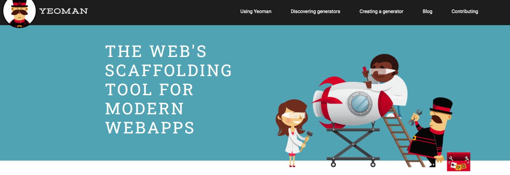
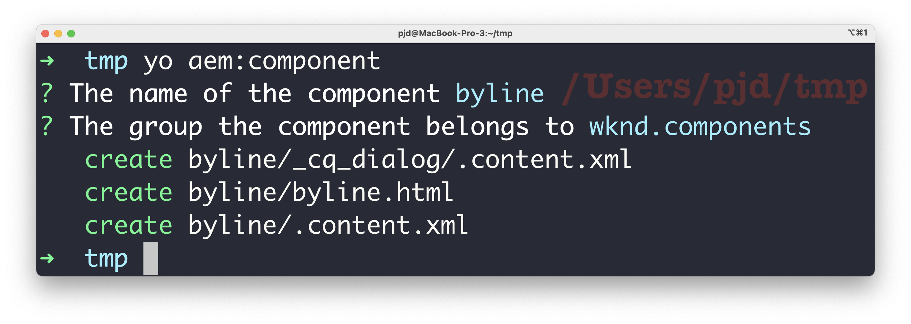

# Templating


## Environment variables
```bash [1|3-4]
http 'Authentication: Bearer 123456789...XYZ' http: //www.example.com

export TOKEN=123456789...XYZ
http "Authentication: Bearer $TOKEN" http://www.example.com
```


## Scripting - Powershell
```ps[|1-9|11-12]
$sql_template = @"
insert into `user`
(email, password, is_active, created_at, updated_at)
values('{0}@emakina.com', sha1('pass'), 1, now(), now() );

insert into user_credential
(user_id,credential,value,created_at,updated_at)
values (LAST_INSERT_ID(),'admin',1,now(),now());
"@

@('admin','press','super-admin','mice','spot')
  |%{$sql_template -f $_}
```


## Scripting - SQL
```sql[1-7|9-14]
SELECT distinct uc.credential as c,
CONCAT("insert into `user` ( email, password,
is_active, created_at, updated_at)
values('",  credential, "@emakina.com', sha1('pass'),
1, now(), now());")
as command
from user_credential uc
UNION
SELECT distinct uc.credential as c,
CONCAT("insert into user_credential (user_id, credential,
value, created_at, updated_at)
values (LAST_INSERT_ID(), '",  credential,"', 1, now(), now());")
as command
from user_credential uc
order by c;
```


## AEM - component
```bash
.content.xml
byline.html
_cq_dialog:
           .content.xml
```


### component xml
```xml[6-8]
<?xml version="1.0" encoding="UTF-8"?>
<jcr:root
    xmlns:sling="http://sling.apache.org/jcr/sling/1.0"
    xmlns:jcr="http://www.jcp.org/jcr/1.0"
    jcr:primaryType="cq:Component"
    jcr:title="Byline"
    jcr:description="Displays a contributor's byline."
    componentGroup="WKND.Content"
    sling:resourceSuperType="core/wcm/components/image/v2/image" />
```


### dialog xml
```xml[|28|13-17]
<?xml version="1.0" encoding="UTF-8"?>
<jcr:root xmlns:sling="http://sling.apache.org/jcr/sling/1.0">
 <content>
  <items>
   <tabs>
    <items>
     <properties jcr:title="Properties">
      <items>
       <columns>
        <items>
         <column>
          <items>
           <!-- we made it!! -->
           <name fieldLabel="Name"
           sling:resourceType="granite/ui/components/coral/
           foundation/form/textfield"
           fieldDescription="The contributor's name to display."/>
          </items>
         </column>
        </items>
       </columns>
      </items>
     </properties>
    </items>
   </tabs>
  </items>
 </content>
</jcr:root>
```


### YEOMAN



### YEOMAN COMPONENT GENERATION

