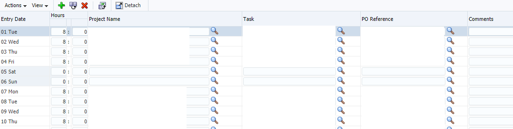

# Timesheeting
Note:
* By show of hands, who likes filling out timesheets? who hates it? Welcome to the dark side :)


## Fusion

Note:
* Really old dud
* Urban legends: only 2 installs of this exotic beta version
* Even oracle stays away from it
* UI / UX really outdated


### jQuery - load & init
```js[|1-5|6-14]
//load in jquery
var jq = document.createElement('script');
jq.src = "https://ajax.googleapis.com/ajax/libs/jquery/2.1.4/jquery.min.js";
document.getElementsByTagName('head')[0].appendChild(jq);
jQuery.noConflict();
//create array with dates of current month
var now = new Date();
daysInMonth=new Date(now.getFullYear(), now.getMonth()+1, 0).getDate();
//create array of all days in current month
var daysOfMonth = [];
for (var day = 1; day <= daysInMonth; day++) {
    var date = new Date(now.getFullYear(),now.getMonth(),day);
    daysOfMonth.push(date);
}
```
Note:
* several people came up with same Idea - jQuery


### jQuery - fill out
```js[|4-8]
for(var i=0;i<daysOfMonth.length;i++){
 var date = daysOfMonth[i];
 //not working in the weekend :)
 if(date.getDay()!=0 && date.getDay()!=6 ){
  jQuery(jQuery('[name$="it1"]')[i]).val(8);//hours
  jQuery(jQuery('[name*="projectFullNameId"]')[i]).val('OIKOI');
  jQuery(jQuery('[name*="taskNameId"]')[i]).val('Development');
  jQuery(jQuery('[name*="fullReferenceId"]')[i]).val(poValue);
 }
}
```
Note:
* Fill out text fields
* some people overbooked a project, things didn't add up
* Management intervened: Book your time in jira as well to ease double-checking


### JQL + Powershell
1. Fetch the stories + time spent
  ```plaintext
/rest/api/2/search?jql=worklogAuthor=pdrouill
AND worklogDate>=startOfMonth()&fields=id,key
  ```
1. enrich data
1. dump in JSON
Note:
* Only book in Jira as usually work on same project for an entire month
* fetch info from Jira
* enrich with po reference, project name, hours worked, ....


### Python + selenium
1. read JSON
1. Simulate manual entry
Note:
* Manual actions are coded, now with Selenium for input (jQuery cannot read local files without setting up webserver)


## What I've learned & saved
* Refreshed jQuery
* Brushed up on Python
* Learned Jira QL & Selenium

* Lot's of time & frustration <!-- .element: class="fragment" data-fragment-index="1"  -->
